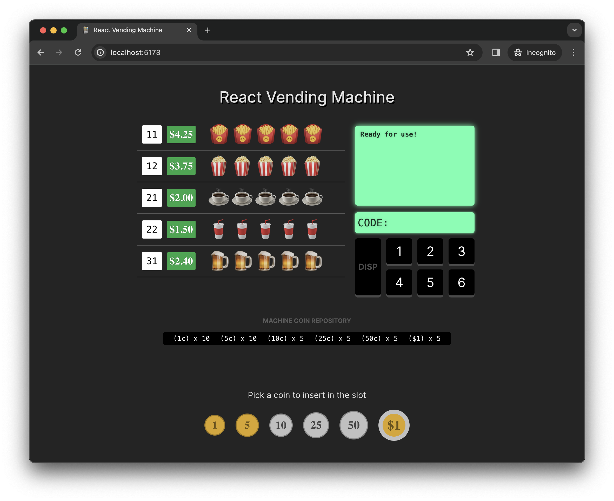

# React Vending Machine

A simple React toy project that simulates a vending machine.

**[Demo](https://hawkgs-rvm.netlify.com)**

### Key details

- Supports an inventory of items
- Works with actual coin denominations
- The machine has a coin repository that is being updated on each order (inserted coins and dispensed change)
- The machine might not be able to process an order, if the requested item is unavailable or the change can't be dispensed (no coins or appropriate denominations)
- Change calculations happen in a Web Worker
